# Foreign Direct Investment (FDI) Analytics Project

## Overview
The Foreign Direct Investment (FDI) Analytics Project aims to provide insightful analysis and visualization of global FDI trends. This project leverages Tableau for data visualization and a CSV data source containing FDI-related metrics.

## Project Files
- **Foreign Direct Investment Analytics.twbx**: Tableau Workbook containing interactive dashboards and visualizations.
- **FDI data.csv**: Source data file in CSV format containing FDI metrics and relevant economic indicators.

## Features
- **Interactive Dashboards**: Explore FDI trends by country, sector, and year.
- **Data Visualizations**: Clear and insightful charts, maps, and graphs.
- **Custom Analysis**: Tailored metrics for business and policy insights.

## Getting Started
### Prerequisites
- **Tableau Desktop**: Required to open and edit the Tableau workbook.
- **Spreadsheet Software**: Any CSV-compatible tool (e.g., Excel) for data review.

### Installation
1. Clone this repository or download the files directly.
2. Ensure Tableau Desktop is installed on your machine.
3. Open the `Foreign Direct Investment Analytics.twbx` file in Tableau.

### Loading Data
1. Verify that the `FDI data.csv` file is in the same directory as the Tableau workbook.
2. Refresh data sources within Tableau if necessary.

## How to Use
- **Navigate Dashboards**: Use the Tableau interface to explore the interactive dashboards.
- **Apply Filters**: Customize views by applying various filters (e.g., country, year, sector).
- **Generate Insights**: Export visualizations and summaries for reporting and presentations.

## Dashboard 1
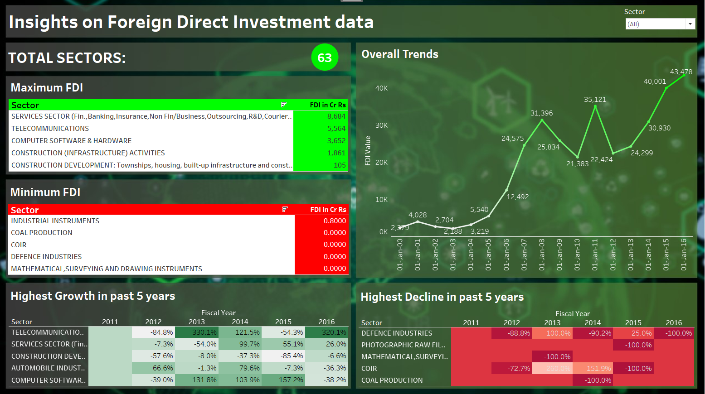

## Dashboard 2
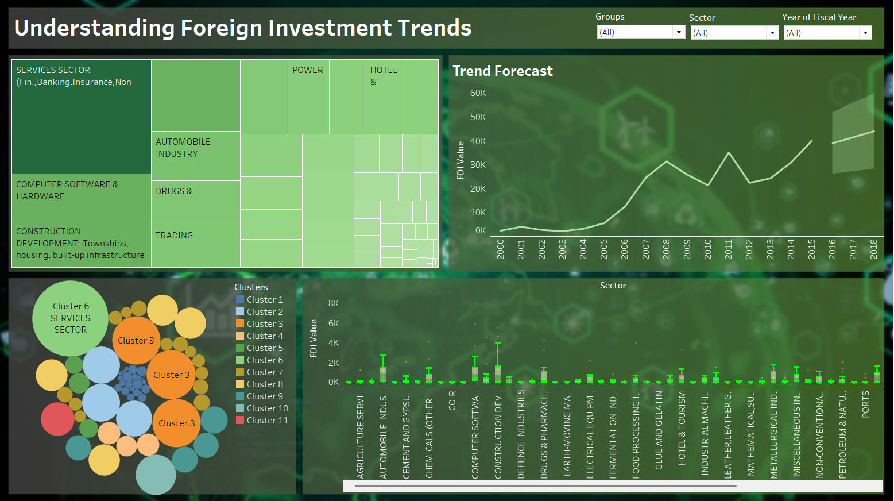

## How the Dashboard is Made
### Sheet: KPI (Key Performance Indicator)

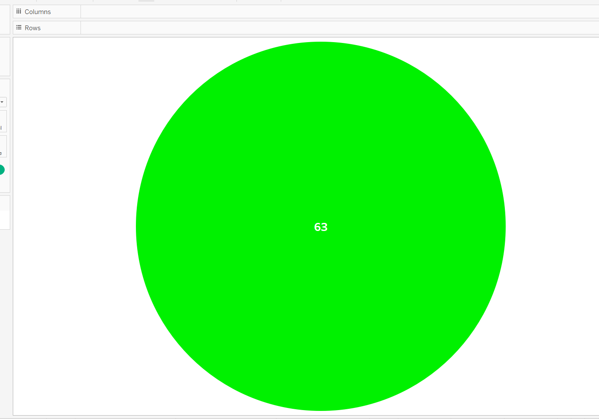
This sheet is designed to display a single KPI value within a pie chart.

#### Steps to Create:
1. **Data Connection**:
   - Connect the `FDI data.csv` file to Tableau.
   - Ensure the necessary fields (e.g., Total Sectors, FDI Value) are correctly imported.

2. **Create the Pie Chart**:
   - Drag the `Total Sectors` field to the **Size** shelf.
   - Drag the same field to the **Label** shelf to display the value (in this case, `63`).
   - Set the **Mark Type** to `Pie` under the Marks card.

3. **Color and Formatting**:
   - Assign a bright green color to the pie chart for emphasis.
   - Adjust the label to display the total value clearly at the center of the pie.

4. **Title**:
   - Add the title "KPI" to the sheet by double-clicking on the title area.

5. **Verify and Save**:
   - Ensure the visual shows the aggregated total sectors clearly.
   - Save the worksheet.

### Sheet: Maximum FDI
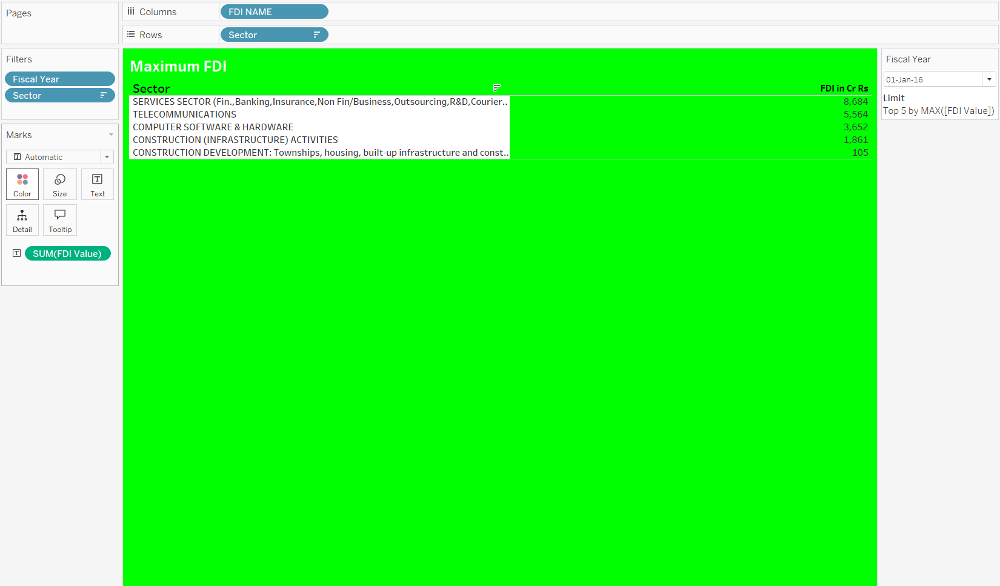
This sheet highlights the sectors with the highest FDI values in a given fiscal year.

#### Steps to Create:
1. **Data Connection**:
   - Connect the `FDI data.csv` file to Tableau.
   - Ensure fields like `Fiscal Year`, `Sector`, and `FDI Value` are imported.

2. **Create the Table**:
   - Drag `Sector` to the Rows shelf.
   - Drag `FDI NAME` to the Columns shelf.
   - Drag `FDI Value` to the Text shelf under Marks.

3. **Filters**:
   - Add `Fiscal Year` to the Filters shelf and select the desired year (e.g., `01-Jan-16`).
   - Add `Sector` to Filters for sector-specific analysis, if needed.

4. **Aggregation and Limiting**:
   - Create a Top N filter to show the top 5 sectors by `FDI Value`. Right-click on the `FDI Value` field, choose Filter, and set it to show the Top 5 by Maximum.

5. **Formatting**:
   - Apply bright green color to the background to emphasize the data.
   - Adjust the title to "Maximum FDI" by double-clicking the title area.
   - Ensure the table displays clear and concise text with formatted values.

6. **Verify and Save**:
   - Ensure the table accurately displays the top 5 sectors with the highest FDI values.
   - Save the worksheet.

### Sheet: Minimum FDI
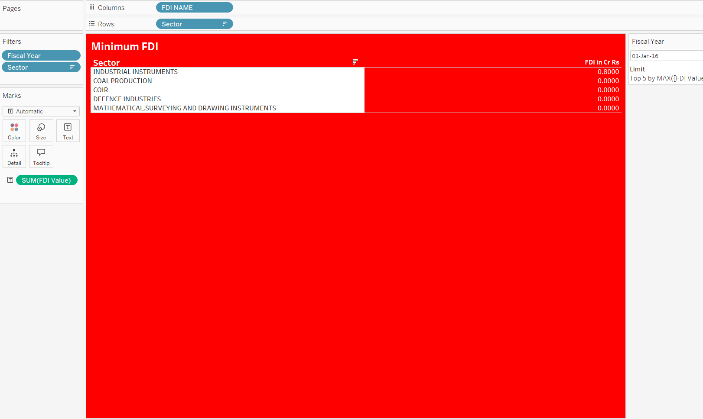
This sheet displays the sectors with the lowest FDI values in a given fiscal year.
#### Steps to Create:
1. **Data Connection**:
   - Connect the `FDI data.csv` file to Tableau.
   - Ensure fields like `Fiscal Year`, `Sector`, and `FDI Value` are imported.

2. **Create the Table**:
   - Drag `Sector` to the Rows shelf.
   - Drag `FDI NAME` to the Columns shelf.
   - Drag `FDI Value` to the Text shelf under Marks.

3. **Filters**:
   - Add `Fiscal Year` to the Filters shelf and select the desired year (e.g., `01-Jan-16`).
   - Add `Sector` to Filters for sector-specific analysis, if needed.

4. **Aggregation and Limiting**:
   - Create a Bottom N filter to show the bottom 5 sectors by `FDI Value`. Right-click on the `FDI Value` field, choose Filter, and set it to show the Bottom 5 by Minimum.

5. **Formatting**:
   - Apply bright red color to the background to emphasize the low values.
   - Adjust the title to "Minimum FDI" by double-clicking the title area.
   - Ensure the table displays clear and concise text with formatted values.

6. **Verify and Save**:
   - Ensure the table accurately displays the bottom 5 sectors with the lowest FDI values.
   - Save the worksheet.

### Sheet: Overall Trends
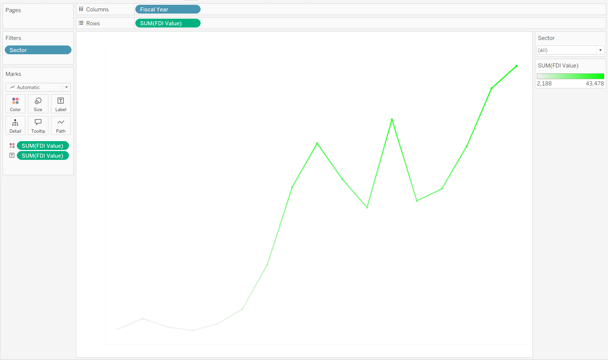
This sheet visualizes the trends of FDI values over time.

#### Steps to Create:
1. **Data Connection**:
   - Connect the `FDI data.csv` file to Tableau.
   - Ensure fields like `Fiscal Year` and `FDI Value` are imported.

2. **Create the Line Chart**:
   - Drag `Fiscal Year` to the Columns shelf.
   - Drag `FDI Value` to the Rows shelf.

3. **Filters**:
   - Add `Sector` to the Filters shelf to allow filtering by sector if needed.

4. **Marks and Formatting**:
   - Set the **Mark Type** to `Line` under the Marks card.
   - Adjust the color of the line to a bright green to highlight the data trend.
   - Add tooltips to display the FDI Value for each year.

5. **Title**:
   - Add the title "Overall Trends" to the sheet by double-clicking on the title area.

6. **Verify and Save**:
   - Ensure the line chart accurately shows the trend of FDI values over time.
   - Save the worksheet.

### Sheet: Groups
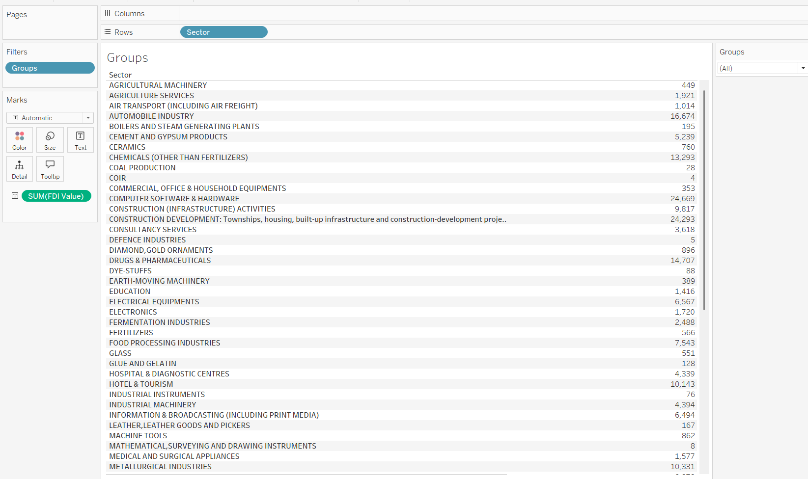
This sheet presents the total FDI value for various sectors grouped based on selected criteria.

#### Steps to Create:
1. **Data Connection**:
   - Connect the `FDI data.csv` file to Tableau.
   - Ensure fields like `Sector`, `Groups`, and `FDI Value` are imported.

2. **Create the Table**:
   - Drag `Sector` to the Rows shelf.
   - Drag `FDI Value` to the Text shelf under Marks.

3. **Filters**:
   - Add `Groups` to the Filters shelf to allow filtering by predefined groupings.

4. **Formatting**:
   - Adjust the table layout to ensure rows are aligned and easy to read.
   - Add tooltips to show additional details like `Groups` and individual `FDI Values`.

5. **Title**:
   - Add the title "Groups" to the sheet by double-clicking on the title area.

6. **Verify and Save**:
   - Ensure the table displays grouped FDI values clearly.
   - Save the worksheet.

### Sheet: Highest Growth in the Past 5 Years
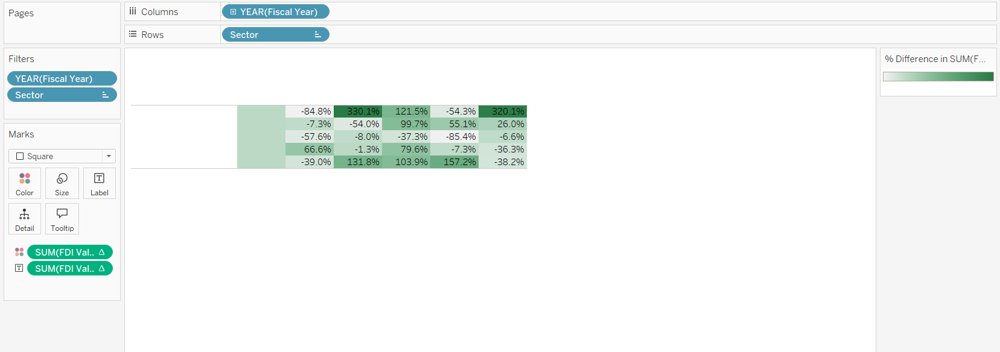
This sheet identifies sectors with the highest growth in FDI values over five years.

#### Steps to Build:

1. **Data Connection**:

   - Import the CSV file into Tableau and validate fields like `Fiscal Year`, `Sector`, and `FDI Value`.

2. **Build the Heatmap**:

   - Drag `Fiscal Year` to the Columns shelf.
   - Place `Sector` in Rows.
   - Add `FDI Value` to Text on the Marks card.
   - Set the Mark Type to `Square`.

3. **Calculate Growth**:

   - Create a calculated field to show the percentage difference in `FDI Value` year-over-year.
   - Drag this calculated field to Color in the Marks card to reflect growth changes.

4. **Format and Label**:

   - Add tooltips to highlight growth percentages and values.
   - Apply conditional formatting for high growth with green and declines with red.

5. **Title and Validation**:

   - Add the title "Highest Growth in Past 5 Years".
   - Validate the chart by checking sector-level growth trends.

6. **Save and Integrate**:

   - Save the worksheet and link it to dashboards or stories.

### Sheet: Proportion of FDI
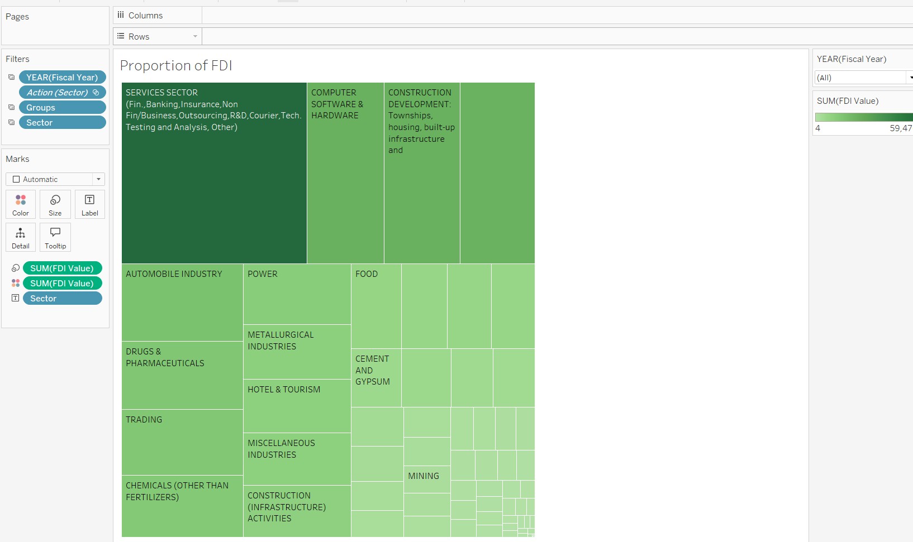
This sheet uses a treemap to visualize the proportion of FDI values across different sectors.

#### Steps to Build:

1. **Data Connection**:

   - Connect the `FDI data.csv` file to Tableau.
   - Ensure fields like `Sector`, `Groups`, and `FDI Value` are imported correctly.

2. **Create the Treemap**:

   - Drag `Sector` to the Rows shelf.
   - Drag `FDI Value` to Size on the Marks card.
   - Drag `FDI Value` again to Label to display values on the treemap.
   - Set the Mark Type to `Automatic` to automatically generate a treemap.

3. **Filters**:

   - Add `Fiscal Year` to Filters to allow filtering by year.
   - Add `Sector` to Filters for sector-specific analysis.

4. **Formatting and Colors**:

   - Use a gradient color scheme (e.g., shades of green) to represent higher and lower FDI values.
   - Ensure labels are clear and readable for each sector block.
   - Add tooltips to provide details about each sector and its FDI value.

5. **Title and Save**:

   - Add the title "Proportion of FDI".
   - Save the worksheet and integrate it with dashboards for comparison purposes.

### Sheet: Cluster Visualization
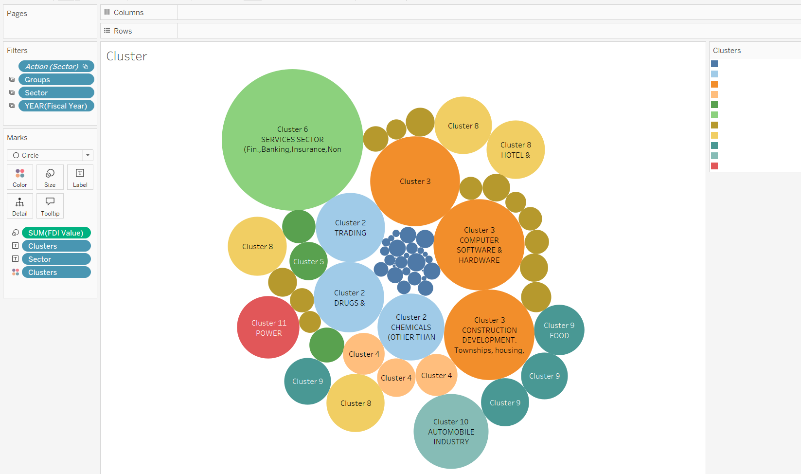
This sheet uses a bubble chart to represent clusters of sectors based on FDI value.

#### Steps to Build:

1. **Data Connection**:

   - Import the `FDI data.csv` file and ensure fields like `Sector`, `FDI Value`, and any clustering variables are included.

2. **Create Clusters**:

   - Use Tableau’s clustering functionality to create clusters based on `FDI Value` and other relevant dimensions (e.g., `Groups`).

3. **Build the Bubble Chart**:

   - Drag `FDI Value` to Size on the Marks card to size the bubbles proportionally.
   - Drag `Clusters` to Color to differentiate clusters visually.
   - Drag `Sector` to Label to display sector names within the bubbles.
   - Set the Mark Type to `Circle`.

4. **Filters**:

   - Add `Fiscal Year` and `Sector` to Filters for dynamic interaction.

5. **Formatting and Colors**:

   - Use distinct colors for each cluster for easy interpretation.
   - Add tooltips to display detailed information about each cluster, such as `FDI Value`, `Sector`, and `Groups`.

6. **Title and Save**:

   - Add the title "Cluster Visualization".
   - Save the worksheet for integration into dashboards or further analysis.

### Sheet: Trend Forecast
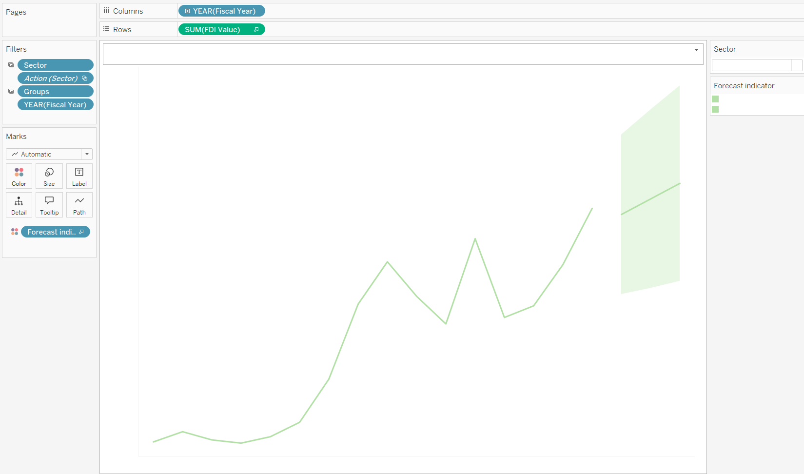
This sheet provides a forecast of FDI values over future periods using a line graph.

#### Steps to Build:

1. **Data Connection**:

   - Import the `FDI data.csv` file into Tableau.
   - Ensure `Fiscal Year`, `Sector`, and `FDI Value` fields are available.

2. **Create the Line Graph**:

   - Drag `Fiscal Year` to the Columns shelf.
   - Drag `FDI Value` to the Rows shelf.

3. **Add Forecasting**:

   - Right-click on the `FDI Value` field in the Rows shelf and select **Add Forecast**.
   - Adjust forecast settings (e.g., forecast length, seasonality) as needed.

4. **Formatting and Interaction**:

   - Add tooltips to display the forecast values.
   - Highlight the forecast range using distinct colors (e.g., shaded area for forecast values).

5. **Filters**:

   - Add `Sector` and `Groups` to Filters to allow for dynamic exploration.

6. **Title and Save**:

   - Add the title "Trend Forecast".
   - Save the worksheet and integrate it into dashboards for predictive analysis.

## ## Contribution Guidelines

1. **Fork the Repository**: Begin by creating a copy of the repository under your GitHub account.
2. **Create a Feature Branch**: Use a descriptive name for your branch that represents the changes you plan to make (e.g., `feature/improve-documentation`).
3. **Make Changes**: Implement the updates or fixes in your branch.
4. **Commit Changes**: Ensure commit messages are clear and meaningful, summarizing the changes made (e.g., `Updated README to include Trend Forecast section`).
5. **Push to GitHub**: Push your feature branch to your GitHub repository.
6. **Open a Pull Request**: Submit a pull request to the main repository, providing a clear description of the changes and their purpose.

## Contact

For questions or support, please reach out via email at amanagnihotri902@gmail.com .

---

---

Thank you for using the Foreign Direct Investment Analytics Project!

